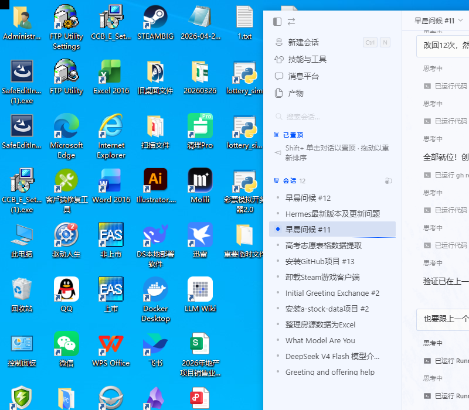

# 🎡 开心猫·吃什么



转盘决定今天吃什么！选择心情 + 回答灵魂拷问，转盘帮你做选择。

**⚠️ 纯属娱乐选择困难，无任何科学依据**

---

## 📦 版本说明

| 版本 | 说明 |
|------|------|
| **在线版** | GitHub Pages 托管，打开即用，支持 PWA 安装到手机 |
| **本地版** | 下载 `index.html` 直接浏览器打开，无需网络 |

---

## 🌐 在线版使用

手机或电脑浏览器直接打开：
> https://gaoxing968.github.io/what-to-eat/

支持"添加到主屏幕"，和原生 App 一样使用。

---

## 💾 本地版使用

下载本仓库 `index.html`，浏览器直接打开即可（支持离线）。

### 本地服务器（可选）
```bash
# Python 3
python -m http.server 8080
# 访问 http://localhost:8080
```

---

## 🎯 功能

- **4种场景模式**：工作日吃什么 / 选择困难 / 省钱模式 / 随便
- **物理惯性动画**：指数衰减减速，更真实的转盘体验
- **心情系统**：选择心情，转盘结果更有趣
- **灵魂拷问**：转动前回答随机问题，增加趣味
- **成就收集**：触发特定条件解锁成就
- **每日12次**：健康使用，不过度纠结
- **PWA**：可安装到手机主屏幕，离线可用

---

## 🎨 菜名清单

覆盖常见快餐/简餐/外卖：

叉烧饭、炒河粉、麻辣烫、炸鸡、黄焖鸡、咖喱鱼蛋、煲仔饭、煎饺、生煎包、锅贴、手抓饼、煎饼果子、兰州拉面、沙县小吃、过桥米线、黄焖鸭腿饭、麻辣香锅、酸菜鱼、烤鱼、披萨、汉堡、三明治、寿司、牛排、烤肉、火锅、串串、冒菜、肠粉、叉烧滑蛋饭、老友粉、螺蛳粉、咖喱饭、蛋炒饭、扬州炒饭……

---

## 📁 项目结构

```
what-to-eat/
├── index.html           # 主程序（完整 PWA 应用）
├── manifest.json        # PWA 清单（桌面图标、主题色）
├── sw.js               # Service Worker（离线缓存）
├── icons/              # 应用图标（192px / 512px）
├── SPEC.md             # 设计文档
└── README.md
```

---

## 🤝 贡献

欢迎提交 Issue 和 Pull Request！

---

## 📧 联系

Made by luckycat · luckycat168968@gmail.com